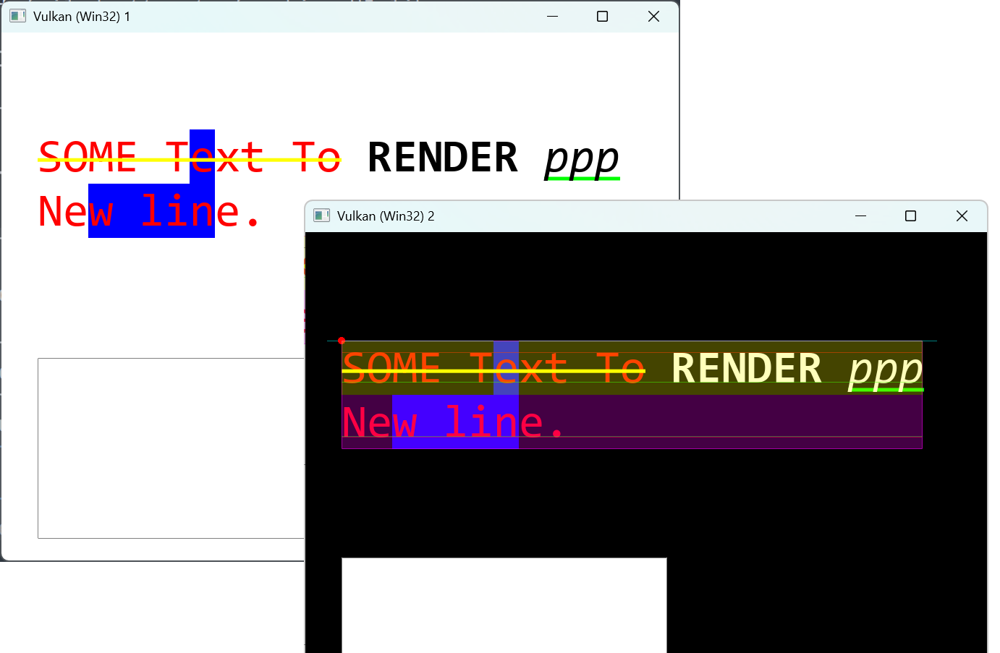

Simple renderer and text shaper/renderer (FreeType) with minimum dependencies.  
Old code from failed attempt at UI library.

## Sample

Run `test_HWND`. Combination of native Win32/GLFW and OpenGL/Vulkan is supported:



## Text_Shaper API

``` cpp
kr::Text_Shaper shaper;
shaper.render_ = &render;
shaper.disable_kerning_ = true;

kr::Text_Markup markup;
markup.color_ = color;
markup.font_fallback_ = &font_family.select_font({.bold = false, .italic = true});
markup.underline_color_ = kk::Color_Green();
shaper.text_add_utf8("underline", markup);

shaper.finish();
// shaper.draw(...);
```

Repetitive `.text_add()` calls with different `Text_Markup`
allows to compose text with different styles:

``` cpp
struct Text_Shaper
{
    // Input.
    KidsRender* render_ = nullptr;
    int wrap_width_ = -1;
    bool use_crlf_ = false;
    bool disable_kerning_ = false;

    // State change.
    void text_add_utf8(const char* utf8, const Text_Markup& markup);
    void text_add(const Text_UTF8& text_utf8, const Text_Markup& markup);
    void finish();

    // ...
};
```

## KidsRender API

``` cpp
struct KidsRender
{
public:
    void line(const kk::Point2f& p1
        , const kk::Point2f& p2
        , const kk::Color& color = kk::Color_White()
        , float width = 1.f
        , const kk::Vec2f& scale = kk::Vec2f{1.f, 1.f}
        , const ClipRect& clip_rect = {}
        , CmdList* cmd_list = nullptr);

    void triangle(const kk::Point2f& p1
        , const kk::Point2f& p2
        , const kk::Point2f& p3
        , const kk::Color& color = kk::Color_White()
        , float width = 1.f
        , const kk::Vec2f& scale = kk::Vec2f{1.f, 1.f}
        , const ClipRect& clip_rect = {}
        , CmdList* cmd_list = nullptr);
    // ...
```

## Build

Regular CMake with VCPKG:

```
cmake -S . -B build ^
	-DCMAKE_TOOLCHAIN_FILE=%VCPKG_ROOT%\scripts\buildsystems\vcpkg.cmake
```

For Vulkan, be sure `VULKAN_SDK` environment variable is properly set.  
For Win32/GLFW and OpenGL/Vulkan variations, see build_all.cmd.
